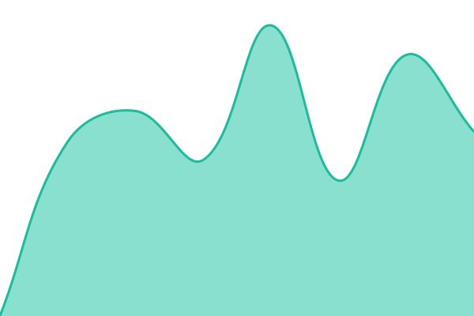
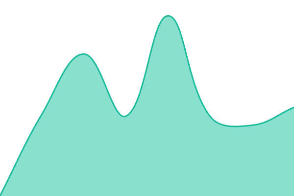

# [📈 Live Status](https://uptime.bbon.me): <!--live status--> **🟩 All systems operational**

This repository contains the open-source uptime monitor and status page for [Pon Cheol, Ku](http://bbon.kr), powered by [Upptime](https://github.com/upptime/upptime).

With [Upptime](https://upptime.js.org), you can get your own unlimited and free uptime monitor and status page, powered entirely by a GitHub repository. We use [Issues](https://github.com/bbonkr/upptime/issues) as incident reports, [Actions](https://github.com/bbonkr/upptime/actions) as uptime monitors, and [Pages](https://uptime.bbon.me) for the status page.

<!--start: status pages-->
<!-- This summary is generated by Upptime (https://github.com/upptime/upptime) -->
<!-- Do not edit this manually, your changes will be overwritten -->
<!-- prettier-ignore -->
| URL | Status | History | Response Time | Uptime |
| --- | ------ | ------- | ------------- | ------ |
|  [bbon.kr](https://bbon.kr) | 🟩 Up | [bbon-kr.yml](https://github.com/bbonkr/uptime/commits/HEAD/history/bbon-kr.yml) | 

 2127ms
     
 | 

<a href="https://uptime.bbon.me/history/bbon-kr">100.00%</a>
    

|  [bbon.me](https://bbon.me) | 🟩 Up | [bbon-me.yml](https://github.com/bbonkr/uptime/commits/HEAD/history/bbon-me.yml) | 

 122ms
     
 | 

<a href="https://uptime.bbon.me/history/bbon-me">100.00%</a>
    

|  [resume.bbon.me](https://resume.bbon.me) | 🟩 Up | [resume-bbon-me.yml](https://github.com/bbonkr/uptime/commits/HEAD/history/resume-bbon-me.yml) | 

 632ms
     
 | 

<a href="https://uptime.bbon.me/history/resume-bbon-me">100.00%</a>
    

|  [dev.bbon.kr](https://dev.bbon.kr) | 🟩 Up | [dev-bbon-kr.yml](https://github.com/bbonkr/uptime/commits/HEAD/history/dev-bbon-kr.yml) | 

 828ms
     
 | 

<a href="https://uptime.bbon.me/history/dev-bbon-kr">100.00%</a>
    

|  [flexbox.bbon.me](https://flexbox.bbon.me) | 🟩 Up | [flexbox-bbon-me.yml](https://github.com/bbonkr/uptime/commits/HEAD/history/flexbox-bbon-me.yml) | 

 549ms
     
 | 

<a href="https://uptime.bbon.me/history/flexbox-bbon-me">100.00%</a>
    

|  [blog.bbon.me](https://blog.bbon.me) | 🟩 Up | [blog-bbon-me.yml](https://github.com/bbonkr/uptime/commits/HEAD/history/blog-bbon-me.yml) | 

 976ms
     
 | 

<a href="https://uptime.bbon.me/history/blog-bbon-me">100.00%</a>
    

|  [apps.bbon.me](https://apps.bbon.me) | 🟩 Up | [apps-bbon-me.yml](https://github.com/bbonkr/uptime/commits/HEAD/history/apps-bbon-me.yml) | 

 609ms
     
 | 

<a href="https://uptime.bbon.me/history/apps-bbon-me">100.00%</a>
    

<!--end: status pages-->

[**Visit our status website →**](https://uptime.bbon.me)

## 📄 License

- Code: [MIT](./LICENSE) © [Pon Cheol, Ku](http://bbon.kr)
- Data in the `./history` directory: [Open Database License](https://opendatacommons.org/licenses/odbl/1-0/)
