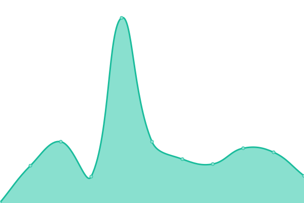

# [📈 Live Status](https://uptime.bbon.me): <!--live status--> **🟩 All systems operational**

This repository contains the open-source uptime monitor and status page for [Pon Cheol, Ku](http://bbon.kr), powered by [Upptime](https://github.com/upptime/upptime).

With [Upptime](https://upptime.js.org), you can get your own unlimited and free uptime monitor and status page, powered entirely by a GitHub repository. We use [Issues](https://github.com/bbonkr/upptime/issues) as incident reports, [Actions](https://github.com/bbonkr/upptime/actions) as uptime monitors, and [Pages](https://uptime.bbon.me) for the status page.

<!--start: status pages-->
<!-- This summary is generated by Upptime (https://github.com/upptime/upptime) -->
<!-- Do not edit this manually, your changes will be overwritten -->

| URL                                                       | Status | History                                                                                                          | Response Time                                                                               | Uptime                                                                                                                                                                                                                          |
| --------------------------------------------------------- | ------ | ---------------------------------------------------------------------------------------------------------------- | ------------------------------------------------------------------------------------------- | ------------------------------------------------------------------------------------------------------------------------------------------------------------------------------------------------------------------------------- |
| [bbon.kr](https://bbon.kr)                                | 🟩 Up  | [bbon-kr.yml](https://github.com/bbonkr/uptime/commits/master/history/bbon-kr.yml)                               |  1617ms               |                                |
| [bbon.me](https://bbon.me)                                | 🟩 Up  | [bbon-me.yml](https://github.com/bbonkr/uptime/commits/master/history/bbon-me.yml)                               |  85ms                 |                                |
| [resume.bbon.me](https://resume.bbon.me)                  | 🟩 Up  | [resume-bbon-me.yml](https://github.com/bbonkr/uptime/commits/master/history/resume-bbon-me.yml)                 |  150ms         |                  |
| [wiki.bbon.kr](https://wiki.bbon.kr)                      | 🟩 Up  | [wiki-bbon-kr.yml](https://github.com/bbonkr/uptime/commits/master/history/wiki-bbon-kr.yml)                     |  1938ms          |                      |
| [wiki.bbon.me](https://wiki.bbon.me)                      | 🟩 Up  | [wiki-bbon-me.yml](https://github.com/bbonkr/uptime/commits/master/history/wiki-bbon-me.yml)                     |  1255ms          |                      |
| [dev.bbon.kr](https://dev.bbon.kr)                        | 🟩 Up  | [dev-bbon-kr.yml](https://github.com/bbonkr/uptime/commits/master/history/dev-bbon-kr.yml)                       |  358ms            |                        |
| [flexbox.bbon.me](https://flexbox.bbon.me)                | 🟩 Up  | [flexbox-bbon-me.yml](https://github.com/bbonkr/uptime/commits/master/history/flexbox-bbon-me.yml)               |  207ms        |                |
| [guid.bbon.me](https://guid.bbon.me)                      | 🟩 Up  | [guid-bbon-me.yml](https://github.com/bbonkr/uptime/commits/master/history/guid-bbon-me.yml)                     |  191ms           |                      |
| [json-formatter.bbon.me](https://json-formatter.bbon.me/) | 🟩 Up  | [json-formatter-bbon-me.yml](https://github.com/bbonkr/uptime/commits/master/history/json-formatter-bbon-me.yml) |  144ms |  |

<!--end: status pages-->

[**Visit our status website →**](https://uptime.bbon.me)

## 📄 License

- Code: [MIT](./LICENSE) © [Pon Cheol, Ku](http://bbon.kr)
- Data in the `./history` directory: [Open Database License](https://opendatacommons.org/licenses/odbl/1-0/)
